# OpenTrust - Government Budget Management System


here is project being live🚀

https://opentrustglobal-frontend.onrender.com/

your account is a treasure to us❤️😍

**Transparent, Secure, and Efficient Budget Management**

## 🌟 Features

### 👤 User Management
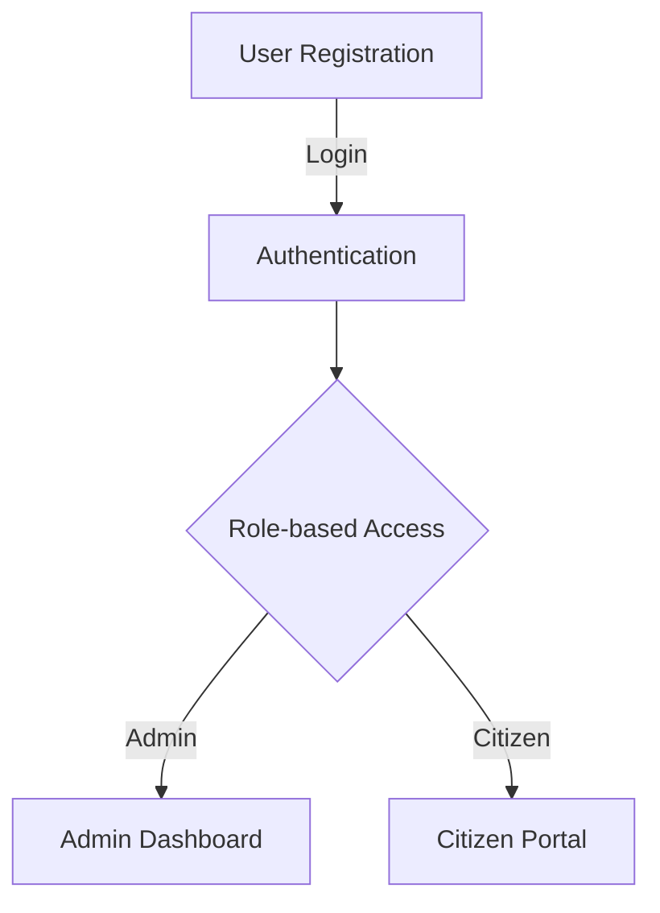
- Multi-role Authentication
- Admin Dashboard with full control
- Citizen Portal for budget tracking
- Secure login and registration system
- Role-based access control

### 💰 Budget Management
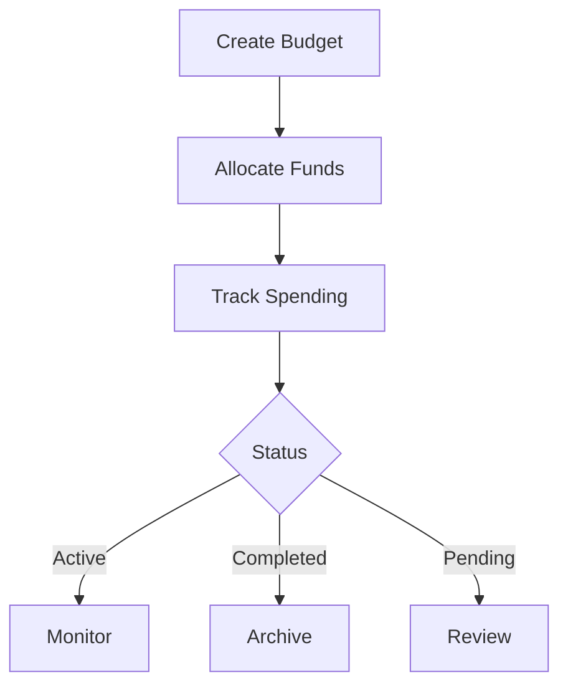
- Comprehensive Budget Control
- Create and manage government budgets
- Track allocated and spent amounts
- Set project timelines with start and end dates
- Monitor budget status (Active/Completed/Pending)
- Department-wise budget allocation
- Detailed project descriptions

### 🏛️ Department Management
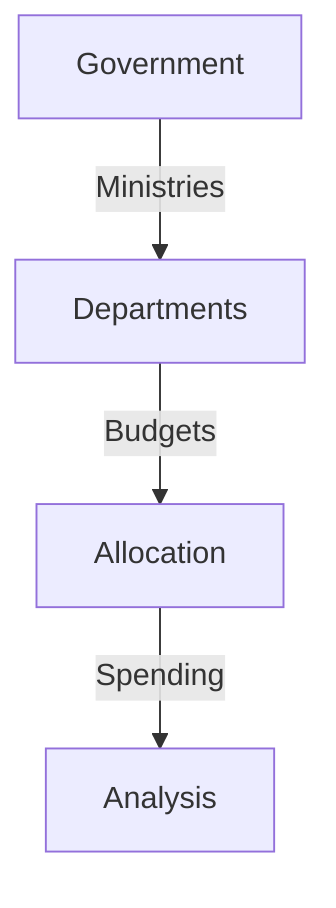
- Organized Structure
- Predefined government departments
- Department-specific budget tracking
- Ministry-level budget allocation
- Department-wise spending analysis

### 📊 Analytics & Reporting
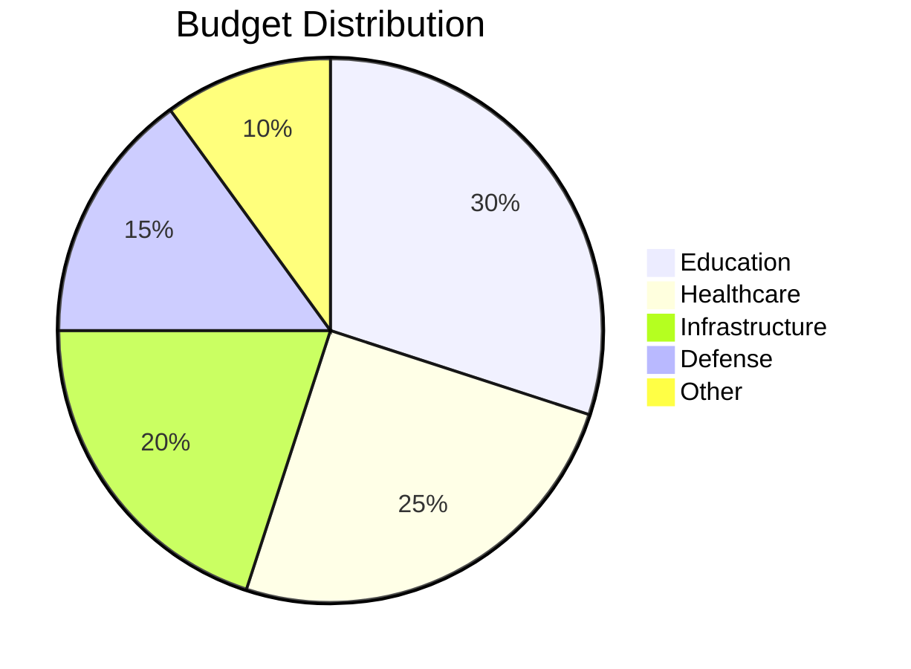
- Real-time Insights
- Interactive budget visualization
- Spending patterns analysis
- Department-wise budget distribution
- Historical budget tracking
- Custom report generation

### 🔍 Fraud Detection
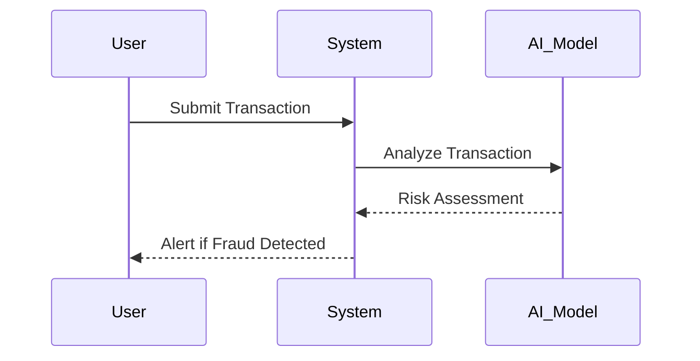
- AI-powered fraud detection
- Anomaly detection in spending patterns
- Suspicious transaction alerts
- Risk assessment reports
- Real-time monitoring system

### 🎨 User Interface
- Modern Design
- Responsive dashboard layout
- Interactive data visualization
- Dark/Light mode support
- Mobile-friendly interface
- Intuitive navigation

### 🔒 Security Features
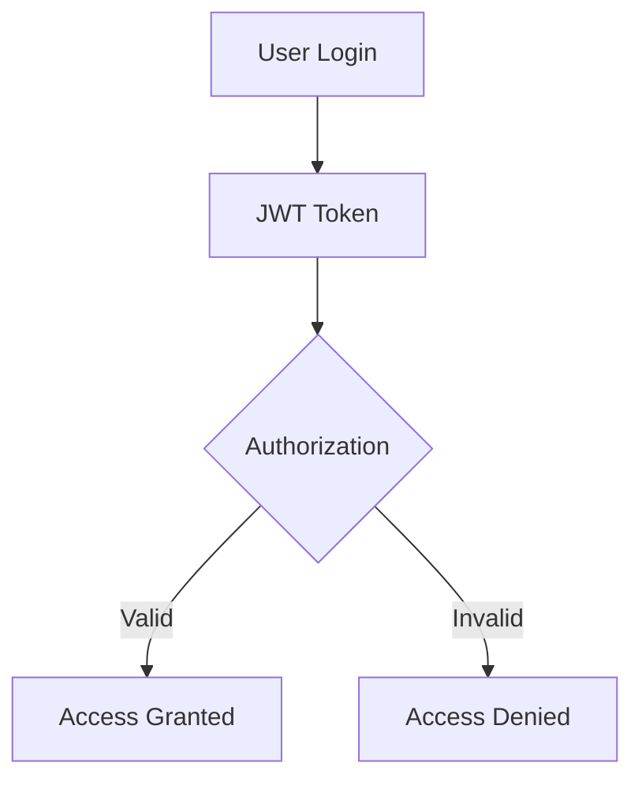
- JWT authentication
- Password hashing
- Role-based authorization
- Secure API endpoints
- Data encryption

## 🛠️ Technology Stack
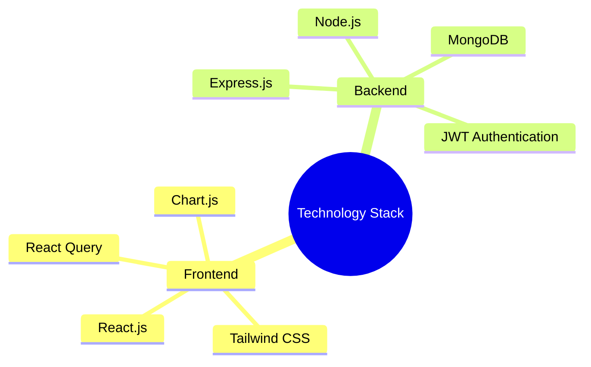

### 🚀 Getting Started

#### Prerequisites
- Node.js (v14 or higher)
- MongoDB
- npm or yarn

#### Installation
```sh
# Clone the repository
git clone https://github.com/yourusername/opentrust.git
cd opentrust

# Install server dependencies
cd server
npm install

# Install client dependencies
cd ../client
npm install
```

#### Set up environment variables
```sh
# In server directory
cp .env.example .env
# Edit .env with your configuration

# In client directory
cp .env.example .env
# Edit .env with your configuration
```

#### Start the development servers
```sh
# Start server (from server directory)
npm run dev

# Start client (from client directory)
npm run dev
```

## 📝 API Documentation

### Authentication Endpoints
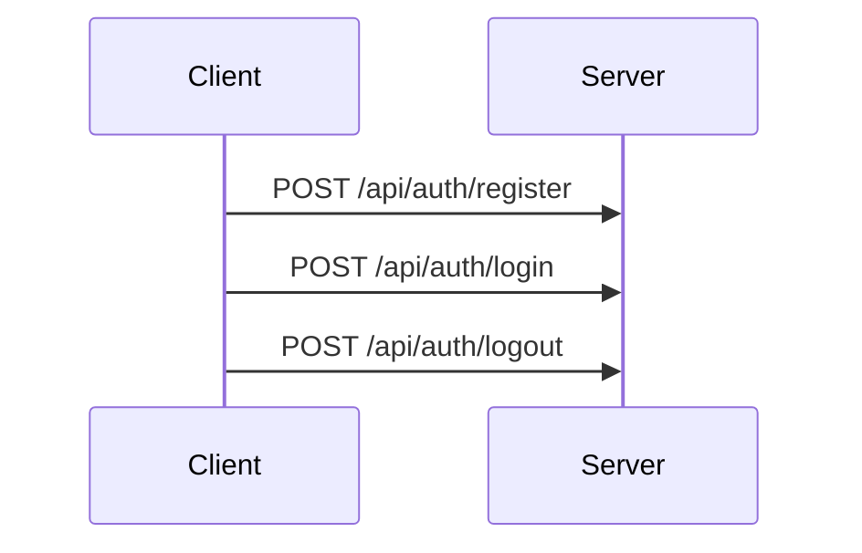

### Budget Endpoints
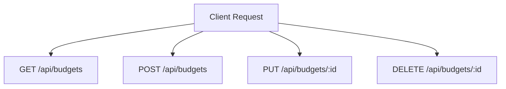

### Fraud Detection Endpoints
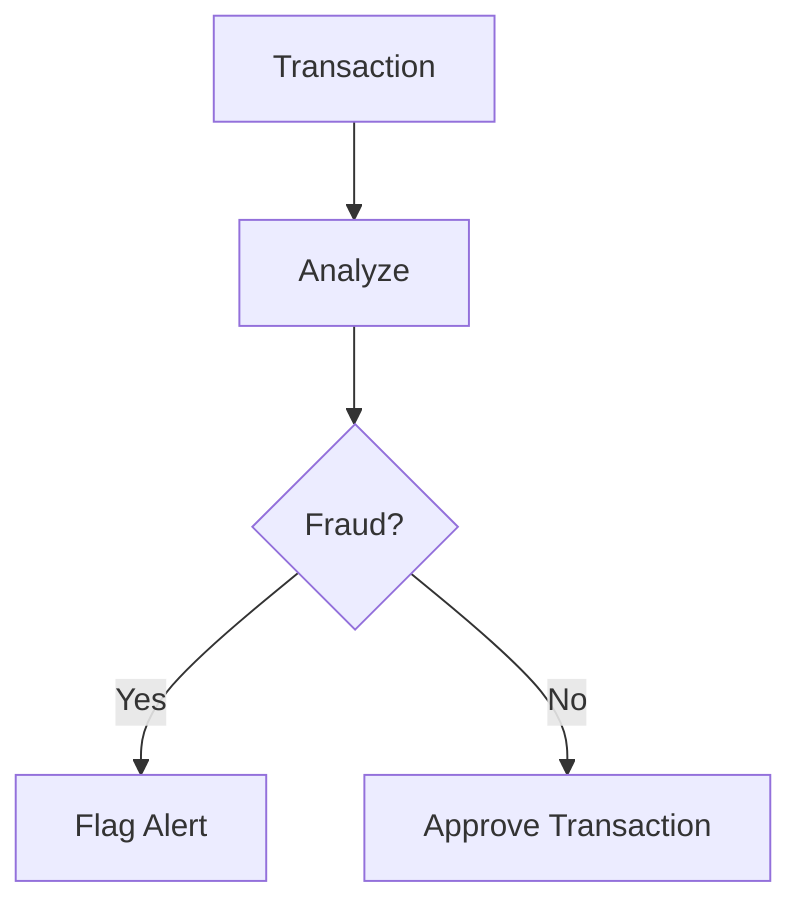

## 🤝 Contributing
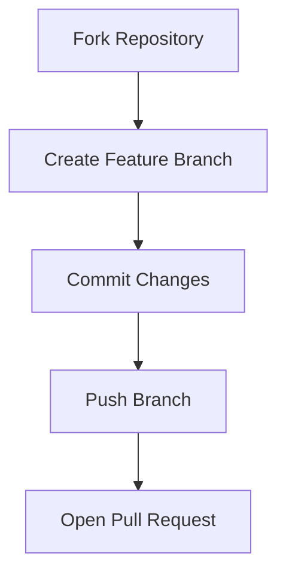
- Fork the repository
- Create your feature branch (`git checkout -b feature/AmazingFeature`)
- Commit your changes (`git commit -m 'Add some AmazingFeature'`)
- Push to the branch (`git push origin feature/AmazingFeature`)
- Open a Pull Request

## 📄 License
This project is licensed under the MIT License - see the LICENSE file for details.

## 👥 Authors
- Abdiawal Aden - Initial work - https://github.com/awale398

## 🙏 Acknowledgments
- Thanks to all contributors who have helped shape OpenTrust
- Special thanks to the open-source community
- Inspired by the need for transparent government spending
- Made with ❤️ for transparent governance

© 2025 OpenTrust. All rights reserved.


